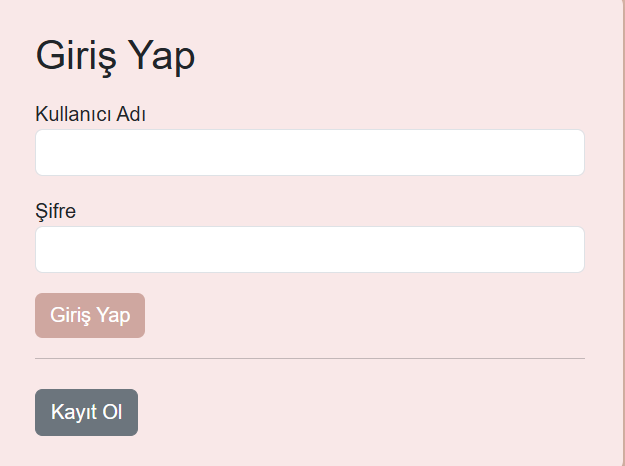
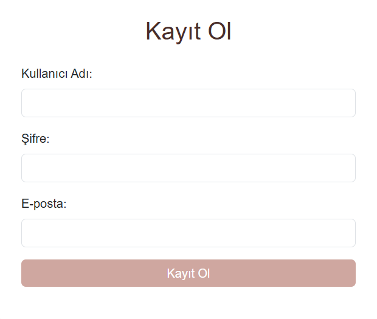
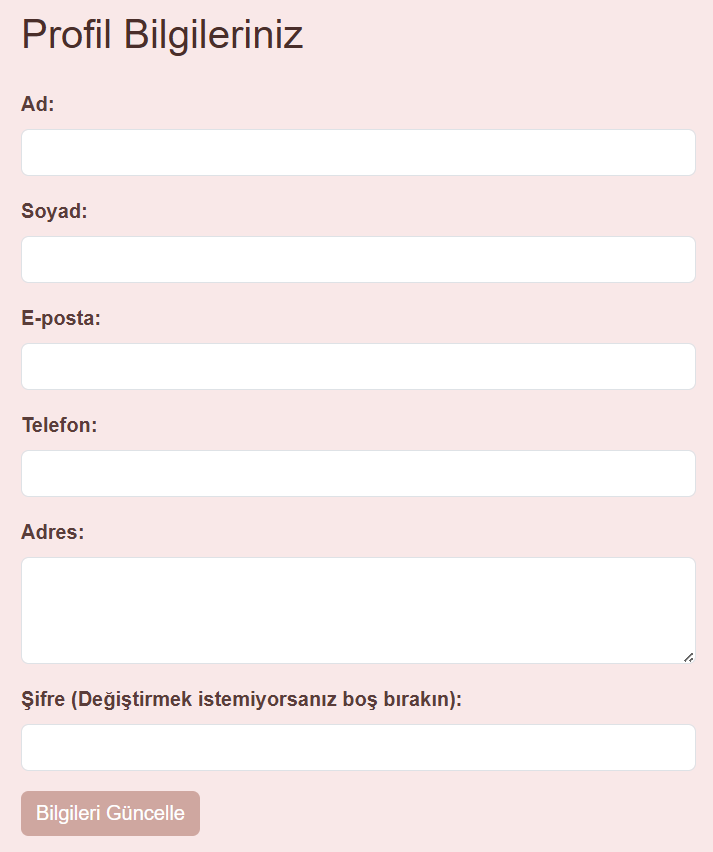
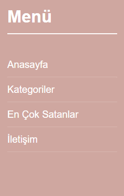
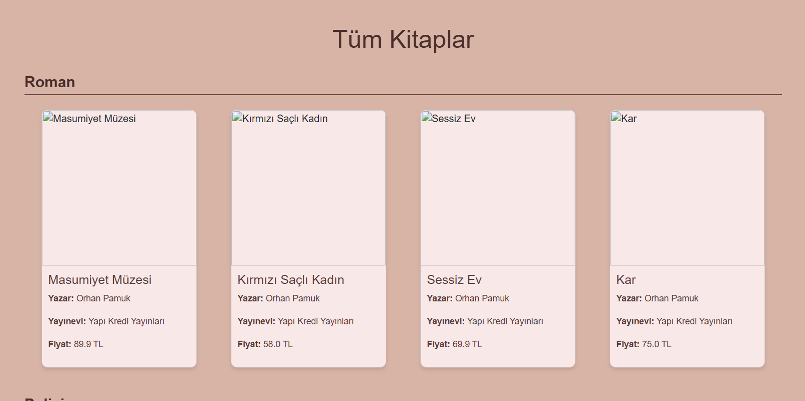
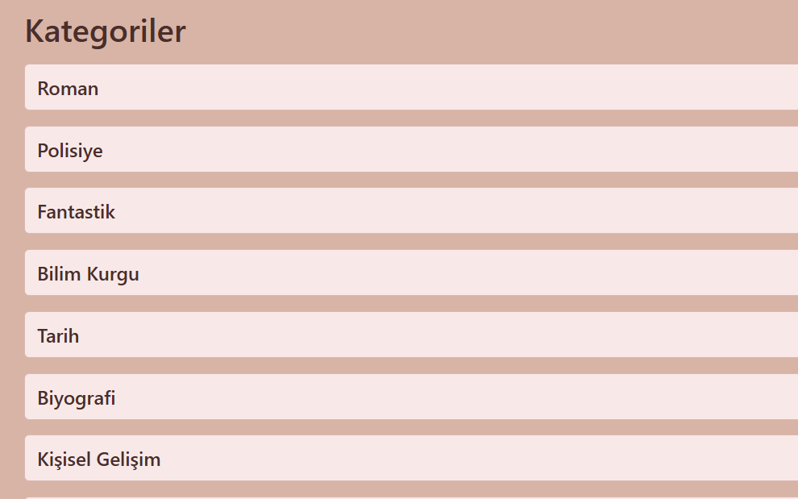
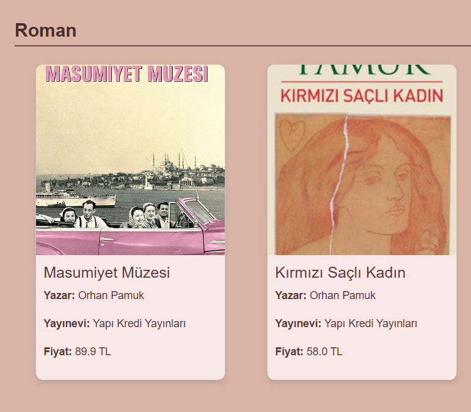
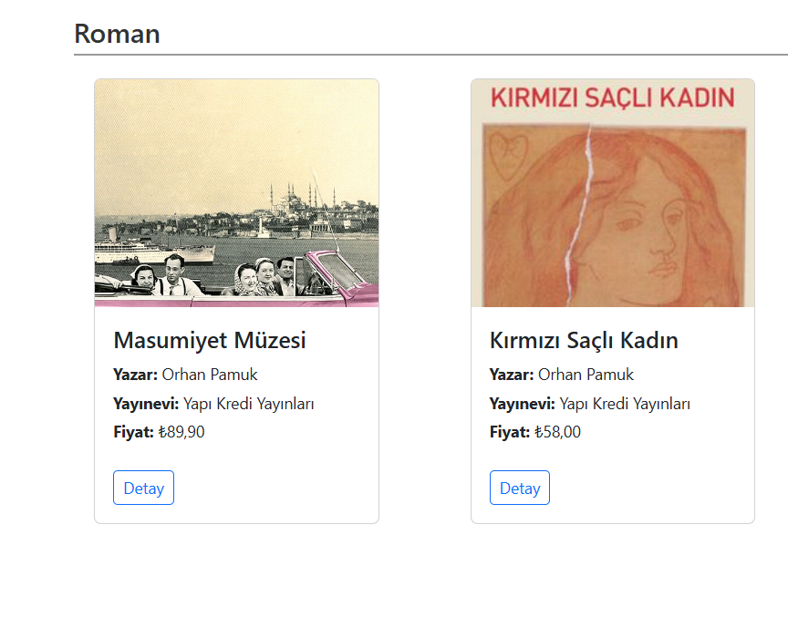
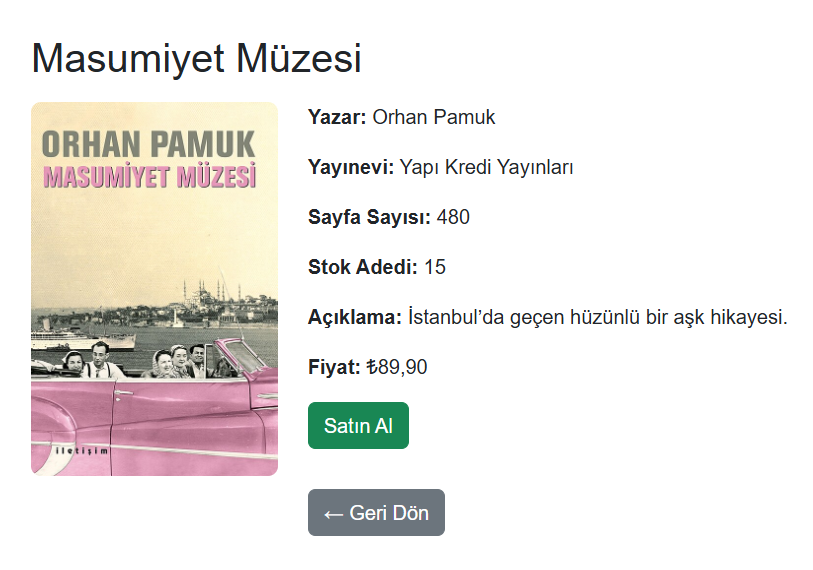

# Bookstore Web Uygulaması

##  Proje Hakkında
Bookstore Web Uygulaması, kullanıcıların kitapları görüntüleyebildiği, arama yapabildiği ve yönetebildiği **Java tabanlı dinamik bir web uygulamasıdır**.

Proje, **MySQL veritabanı**, **JDBC (MySQL Connector/J)** ve **Apache Tomcat** kullanılarak geliştirilmiştir.

Amaç; backend geliştirme, veritabanı yönetimi ve CRUD işlemleri konusunda pratik deneyim kazanmaktır.

---

##  Özellikler

- Kullanıcı kayıt ve giriş sistemi
- Kitap ekleme, silme, güncelleme ve listeleme (CRUD işlemleri)
- Kategori bazlı kitap yönetimi
- Kitap arama ve filtreleme
- MySQL ile dinamik veri yönetimi
- Admin paneli (varsa eklenebilir)

---

##  Kullanılan Teknolojiler

- Java (Servlet / JSP)
- Apache Tomcat
- MySQL
- JDBC (MySQL Connector/J)
- HTML, CSS, Bootstrap
- Git & GitHub

---

## Veritabanı Yapısı

### Kullanıcılar

- id
- kullanıcı_adı
- email
- şifre

### Kitaplar

- id
- kitap_adı
- yazar_id
-  kategori_id
-  fiyat
- stok
- açıklama

### Yazarlar

- id
- yazar_adı

### Kategoriler

- id
- kategori_adı

  
---

## Gelecek Geliştirmeler

- Role-based yetkilendirme (admin / user)
- REST API geliştirme
- Gelişmiş arama ve filtreleme sistemi
- Modern frontend geliştirmeleri

## 📷 Ekran Görüntüleri

### Giriş

### Kayıt

### Güncelle

### Menü

### Anasayfa

### Anasayfa

### Kitap1

### Kitap2

### Kitap3

